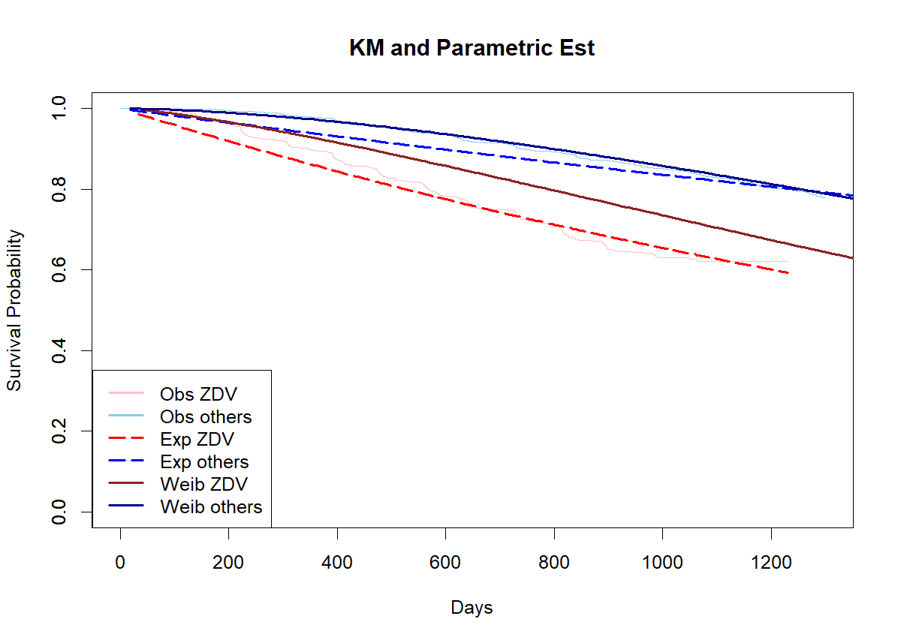

Analysis
================
Zhuodiao Kuang
2023-11-25

# Model selection with tests

    Start:  AIC=7378.94
    Surv(time, cid) ~ trt + age + wtkg + hemo + homo + drugs + karnof + 
        oprior + z30 + zprior + preanti + race + gender + str2 + 
        strat + symptom + treat + offtrt + cd40 + cd420 + cd80 + 
        cd820


    Step:  AIC=7378.94
    Surv(time, cid) ~ trt + age + wtkg + hemo + homo + drugs + karnof + 
        oprior + z30 + preanti + race + gender + str2 + strat + symptom + 
        treat + offtrt + cd40 + cd420 + cd80 + cd820

              Df    AIC
    - cd80     1 7371.3
    - str2     1 7371.3
    - wtkg     1 7371.3
    - oprior   1 7371.3
    - trt      1 7371.3
    - homo     1 7371.4
    - hemo     1 7372.0
    - gender   1 7372.1
    - z30      1 7372.2
    - race     1 7372.5
    - strat    1 7373.0
    - age      1 7374.3
    - karnof   1 7374.9
    - drugs    1 7376.1
    - cd40     1 7378.0
    - cd820    1 7378.5
    <none>       7378.9
    - preanti  1 7379.7
    - treat    1 7379.9
    - symptom  1 7381.5
    - offtrt   1 7395.6
    - cd420    1 7581.9

    Step:  AIC=7371.27
    Surv(time, cid) ~ trt + age + wtkg + hemo + homo + drugs + karnof + 
        oprior + z30 + preanti + race + gender + str2 + strat + symptom + 
        treat + offtrt + cd40 + cd420 + cd820

              Df    AIC
    - str2     1 7363.6
    - wtkg     1 7363.6
    - oprior   1 7363.7
    - trt      1 7363.7
    - homo     1 7363.8
    - hemo     1 7364.4
    - gender   1 7364.4
    - z30      1 7364.6
    - race     1 7364.8
    - strat    1 7365.4
    - age      1 7366.6
    - karnof   1 7367.2
    - drugs    1 7368.4
    <none>       7371.3
    - cd40     1 7371.9
    - preanti  1 7372.0
    - treat    1 7372.3
    - symptom  1 7373.8
    - cd820    1 7384.1
    - offtrt   1 7387.9
    - cd420    1 7614.0

    Step:  AIC=7363.62
    Surv(time, cid) ~ trt + age + wtkg + hemo + homo + drugs + karnof + 
        oprior + z30 + preanti + race + gender + strat + symptom + 
        treat + offtrt + cd40 + cd420 + cd820

              Df    AIC
    - wtkg     1 7356.0
    - trt      1 7356.0
    - oprior   1 7356.0
    - homo     1 7356.1
    - hemo     1 7356.7
    - gender   1 7356.8
    - race     1 7357.2
    - z30      1 7357.3
    - age      1 7359.0
    - strat    1 7359.1
    - karnof   1 7359.6
    - drugs    1 7360.8
    <none>       7363.6
    - cd40     1 7364.2
    - treat    1 7364.7
    - preanti  1 7365.3
    - symptom  1 7366.3
    - cd820    1 7376.5
    - offtrt   1 7380.3
    - cd420    1 7606.4

    Step:  AIC=7355.98
    Surv(time, cid) ~ trt + age + hemo + homo + drugs + karnof + 
        oprior + z30 + preanti + race + gender + strat + symptom + 
        treat + offtrt + cd40 + cd420 + cd820

              Df    AIC
    - trt      1 7348.4
    - oprior   1 7348.4
    - homo     1 7348.5
    - hemo     1 7349.1
    - gender   1 7349.1
    - race     1 7349.5
    - z30      1 7349.7
    - age      1 7351.3
    - strat    1 7351.4
    - karnof   1 7351.9
    - drugs    1 7353.1
    <none>       7356.0
    - cd40     1 7356.6
    - treat    1 7357.1
    - preanti  1 7357.7
    - symptom  1 7358.7
    - cd820    1 7369.0
    - offtrt   1 7372.7
    - cd420    1 7599.4

    Step:  AIC=7348.4
    Surv(time, cid) ~ age + hemo + homo + drugs + karnof + oprior + 
        z30 + preanti + race + gender + strat + symptom + treat + 
        offtrt + cd40 + cd420 + cd820

              Df    AIC
    - oprior   1 7340.8
    - homo     1 7340.9
    - hemo     1 7341.5
    - gender   1 7341.5
    - race     1 7341.9
    - z30      1 7342.1
    - age      1 7343.7
    - strat    1 7343.8
    - karnof   1 7344.4
    - drugs    1 7345.5
    <none>       7348.4
    - cd40     1 7349.0
    - preanti  1 7350.2
    - symptom  1 7351.0
    - cd820    1 7361.5
    - treat    1 7362.8
    - offtrt   1 7365.0
    - cd420    1 7594.2

    Step:  AIC=7340.82
    Surv(time, cid) ~ age + hemo + homo + drugs + karnof + z30 + 
        preanti + race + gender + strat + symptom + treat + offtrt + 
        cd40 + cd420 + cd820

              Df    AIC
    - homo     1 7333.3
    - hemo     1 7333.9
    - gender   1 7333.9
    - race     1 7334.4
    - z30      1 7335.3
    - age      1 7336.1
    - karnof   1 7336.8
    - strat    1 7337.5
    - drugs    1 7337.9
    <none>       7340.8
    - cd40     1 7341.5
    - preanti  1 7343.2
    - symptom  1 7343.5
    - cd820    1 7354.2
    - treat    1 7355.2
    - offtrt   1 7357.5
    - cd420    1 7586.5

    Step:  AIC=7333.33
    Surv(time, cid) ~ age + hemo + drugs + karnof + z30 + preanti + 
        race + gender + strat + symptom + treat + offtrt + cd40 + 
        cd420 + cd820

              Df    AIC
    - hemo     1 7326.3
    - gender   1 7326.3
    - race     1 7326.8
    - z30      1 7327.8
    - age      1 7328.6
    - karnof   1 7329.3
    - strat    1 7330.0
    - drugs    1 7330.3
    <none>       7333.3
    - cd40     1 7333.9
    - preanti  1 7335.6
    - symptom  1 7335.9
    - cd820    1 7346.7
    - treat    1 7347.7
    - offtrt   1 7349.9
    - cd420    1 7578.9

    Step:  AIC=7326.27
    Surv(time, cid) ~ age + drugs + karnof + z30 + preanti + race + 
        gender + strat + symptom + treat + offtrt + cd40 + cd420 + 
        cd820

              Df    AIC
    - gender   1 7319.1
    - race     1 7319.7
    - z30      1 7320.9
    - age      1 7322.3
    - karnof   1 7322.5
    - drugs    1 7323.0
    - strat    1 7323.3
    <none>       7326.3
    - cd40     1 7326.9
    - preanti  1 7328.5
    - symptom  1 7329.6
    - cd820    1 7340.2
    - treat    1 7341.1
    - offtrt   1 7342.8
    - cd420    1 7571.2

    Step:  AIC=7319.12
    Surv(time, cid) ~ age + drugs + karnof + z30 + preanti + race + 
        strat + symptom + treat + offtrt + cd40 + cd420 + cd820

              Df    AIC
    - race     1 7313.2
    - z30      1 7313.5
    - age      1 7315.2
    - karnof   1 7315.5
    - strat    1 7316.1
    - drugs    1 7316.3
    <none>       7319.1
    - cd40     1 7319.7
    - preanti  1 7321.5
    - symptom  1 7322.6
    - treat    1 7333.7
    - cd820    1 7334.2
    - offtrt   1 7335.4
    - cd420    1 7564.2

    Step:  AIC=7313.19
    Surv(time, cid) ~ age + drugs + karnof + z30 + preanti + strat + 
        symptom + treat + offtrt + cd40 + cd420 + cd820

              Df    AIC
    - z30      1 7307.6
    - karnof   1 7309.5
    - age      1 7310.0
    - strat    1 7310.0
    - drugs    1 7310.9
    <none>       7313.2
    - cd40     1 7313.5
    - preanti  1 7316.0
    - symptom  1 7317.4
    - cd820    1 7327.7
    - treat    1 7328.0
    - offtrt   1 7330.0
    - cd420    1 7556.9

    Step:  AIC=7307.58
    Surv(time, cid) ~ age + drugs + karnof + preanti + strat + symptom + 
        treat + offtrt + cd40 + cd420 + cd820

              Df    AIC
    - strat    1 7302.3
    - karnof   1 7304.0
    - age      1 7304.0
    - drugs    1 7305.0
    <none>       7307.6
    - cd40     1 7308.0
    - preanti  1 7309.6
    - symptom  1 7311.5
    - treat    1 7322.1
    - cd820    1 7322.2
    - offtrt   1 7324.5
    - cd420    1 7552.2

    Step:  AIC=7302.33
    Surv(time, cid) ~ age + drugs + karnof + preanti + symptom + 
        treat + offtrt + cd40 + cd420 + cd820

              Df    AIC
    - karnof   1 7298.4
    - age      1 7298.8
    - drugs    1 7300.0
    <none>       7302.3
    - cd40     1 7303.1
    - preanti  1 7304.4
    - symptom  1 7305.6
    - cd820    1 7317.2
    - treat    1 7317.2
    - offtrt   1 7320.6
    - cd420    1 7545.0

    Step:  AIC=7298.39
    Surv(time, cid) ~ age + drugs + preanti + symptom + treat + offtrt + 
        cd40 + cd420 + cd820

              Df    AIC
    - drugs    1 7295.4
    - age      1 7295.6
    <none>       7298.4
    - cd40     1 7298.7
    - preanti  1 7300.6
    - symptom  1 7303.8
    - cd820    1 7312.6
    - treat    1 7313.4
    - offtrt   1 7319.6
    - cd420    1 7546.2

    Step:  AIC=7295.36
    Surv(time, cid) ~ age + preanti + symptom + treat + offtrt + 
        cd40 + cd420 + cd820

              Df    AIC
    - age      1 7291.9
    - cd40     1 7295.3
    <none>       7295.4
    - preanti  1 7298.3
    - symptom  1 7301.0
    - cd820    1 7309.3
    - treat    1 7310.7
    - offtrt   1 7314.1
    - cd420    1 7545.6

    Step:  AIC=7291.94
    Surv(time, cid) ~ preanti + symptom + treat + offtrt + cd40 + 
        cd420 + cd820

              Df    AIC
    - cd40     1 7291.8
    <none>       7291.9
    - preanti  1 7296.4
    - symptom  1 7298.0
    - cd820    1 7307.2
    - treat    1 7307.7
    - offtrt   1 7309.7
    - cd420    1 7541.6

    Step:  AIC=7291.83
    Surv(time, cid) ~ preanti + symptom + treat + offtrt + cd420 + 
        cd820

              Df    AIC
    <none>       7291.8
    - symptom  1 7296.2
    - preanti  1 7297.0
    - cd820    1 7306.3
    - offtrt   1 7308.1
    - treat    1 7310.4
    - cd420    1 7600.9

``` r
summary(stepwise) 
```

    Call:
    coxph(formula = Surv(time, cid) ~ preanti + symptom + treat + 
        offtrt + cd420 + cd820, data = data)

      n= 2139, number of events= 521 

                  coef  exp(coef)   se(coef)       z Pr(>|z|)    
    preanti  3.354e-04  1.000e+00  9.130e-05   3.674 0.000239 ***
    symptom  3.609e-01  1.435e+00  1.011e-01   3.570 0.000357 ***
    treat   -4.872e-01  6.143e-01  9.253e-02  -5.266 1.40e-07 ***
    offtrt   4.502e-01  1.569e+00  9.097e-02   4.948 7.48e-07 ***
    cd420   -7.403e-03  9.926e-01  4.578e-04 -16.172  < 2e-16 ***
    cd820    4.689e-04  1.000e+00  9.449e-05   4.963 6.94e-07 ***
    ---
    Signif. codes:  0 '***' 0.001 '**' 0.01 '*' 0.05 '.' 0.1 ' ' 1

            exp(coef) exp(-coef) lower .95 upper .95
    preanti    1.0003     0.9997    1.0002    1.0005
    symptom    1.4346     0.6971    1.1767    1.7490
    treat      0.6143     1.6278    0.5124    0.7365
    offtrt     1.5686     0.6375    1.3124    1.8747
    cd420      0.9926     1.0074    0.9917    0.9935
    cd820      1.0005     0.9995    1.0003    1.0007

    Concordance= 0.766  (se = 0.01 )
    Likelihood ratio test= 485.6  on 6 df,   p=<2e-16
    Wald test            = 411.6  on 6 df,   p=<2e-16
    Score (logrank) test = 425.9  on 6 df,   p=<2e-16

``` r
broom::tidy(stepwise) |>kbl()
```

<table>
<thead>
<tr>
<th style="text-align:left;">
term
</th>
<th style="text-align:right;">
estimate
</th>
<th style="text-align:right;">
std.error
</th>
<th style="text-align:right;">
statistic
</th>
<th style="text-align:right;">
p.value
</th>
</tr>
</thead>
<tbody>
<tr>
<td style="text-align:left;">
preanti
</td>
<td style="text-align:right;">
0.0003354
</td>
<td style="text-align:right;">
0.0000913
</td>
<td style="text-align:right;">
3.673646
</td>
<td style="text-align:right;">
0.0002391
</td>
</tr>
<tr>
<td style="text-align:left;">
symptom
</td>
<td style="text-align:right;">
0.3608808
</td>
<td style="text-align:right;">
0.1010939
</td>
<td style="text-align:right;">
3.569759
</td>
<td style="text-align:right;">
0.0003573
</td>
</tr>
<tr>
<td style="text-align:left;">
treat
</td>
<td style="text-align:right;">
-0.4872220
</td>
<td style="text-align:right;">
0.0925251
</td>
<td style="text-align:right;">
-5.265835
</td>
<td style="text-align:right;">
0.0000001
</td>
</tr>
<tr>
<td style="text-align:left;">
offtrt
</td>
<td style="text-align:right;">
0.4501628
</td>
<td style="text-align:right;">
0.0909720
</td>
<td style="text-align:right;">
4.948366
</td>
<td style="text-align:right;">
0.0000007
</td>
</tr>
<tr>
<td style="text-align:left;">
cd420
</td>
<td style="text-align:right;">
-0.0074031
</td>
<td style="text-align:right;">
0.0004578
</td>
<td style="text-align:right;">
-16.172233
</td>
<td style="text-align:right;">
0.0000000
</td>
</tr>
<tr>
<td style="text-align:left;">
cd820
</td>
<td style="text-align:right;">
0.0004689
</td>
<td style="text-align:right;">
0.0000945
</td>
<td style="text-align:right;">
4.962948
</td>
<td style="text-align:right;">
0.0000007
</td>
</tr>
</tbody>
</table>

Our goal is to investigate the difference between two groups of
different treatments(ZDV), therefore we pre-specified to stratify by
treatment in the model.

# Graphical Methods

Recall a PH model,
$S(t|Z=z) = e^{-\int h_0(t)e^{\beta z}dt} = S_0(t)^{e^{\beta z}}$, by
using a log-log transformation, i.e., $log\{-logS(t|Z=z)\}$, we have
$$log\{-log\hat{S}(t|Z=z)\}-log\{-log\hat{S_0}(t)\} = \beta $$ for
indicator variable $Z$. This indicates two parallel lines under
proportionality assumption.

``` r
library(ggfortify)
library(StepReg)
data_fit <- data |>
  dplyr::select(time, cid, treat, preanti, symptom, offtrt, cd420, cd820) |>
  mutate_at(c(3, 5, 6), .funs = ~as.factor(.))


# --- treat ---
# km plot
fit_km_treat <- survfit(Surv(time, cid) ~ treat, data_fit)
autoplot(fit_km_treat) + theme_bw() +
  labs(x = "Time (days)", y = "Survival Function",
       title = "Kaplan-Meier Survival Estimate")
```


``` r
# loglog vs. log time
# png("ph_checking_1.png", width = 500, height = 400)
plot(fit_km_treat, fun = "cloglog", col = c("black", "red"),
     xlab = "Time (days in log scale)", ylab = "log{-log(S(t))}",
     main = "Log of Negative Log of Estimated Survival Functions")
legend("topleft", legend = c("ZDV only", "Others"), col = c("black", "red"), 
       lty = 1, cex = 1)
```


``` r
# observed vs. fitted
fit_ph_treat <- coxph(Surv(time, cid) ~ treat, data_fit)

# png("ph_checking_2.png", width = 500, height = 400)
plot(fit_km_treat, col = c("blue", "darkgreen"),
     xlab = "Time (days)", ylab = "Survival Function",
     ylim = c(0.4,1),
     main = "Observed vs. Fitted")
lines(survfit(fit_ph_treat, newdata = data.frame(treat = as.factor(0))), # 0
      col = "red", conf.int = FALSE)
lines(survfit(fit_ph_treat, newdata = data.frame(treat = as.factor(1))), # 1
      col = "black", conf.int = FALSE)
legend("bottomleft", legend = c("Observed Male", "Observed Female",
                                "Fitted Male", "Fitted Female"), 
       col = c("blue", "darkgreen", "red", "black"), lty = 1, cex = 1, lwd = 2)
```


**Interpretation:** The above two figures demonstrate the proportional
hazards assumption is hold given there is only one indicator variable
`treat` in the model.

- The above methods work only for categorical variable, the slope in
  plots of residuals such as Schoenfeld vs. time can be used instead for
  continuous cases.

## Model checking II

But first, let’s use the same covariates as above, plus the
corresponding interaction terms s.t., \*\*covariate\*time\*\*. Results
are shown as follows.

### Interaction test

``` r
library(survminer)
# --- to be updated ---

# interaction
aids_interaction_fit <- coxph(Surv(time, cid == 1) ~ treat+ preanti+ symptom+ offtrt + cd420+ cd820+ log(time):treat+log(time):preanti+log(time):symptom+log(time):offtrt + log(time):cd420+log(time):cd820, data_fit)

summary(aids_interaction_fit)$coefficients |>
  kable("latex", 
        digits = 4, 
        escape = F, 
        booktabs = T, 
caption = "Regresion Coefficients Estimates of the Cox Model with Time Interactions") |>
  kable_styling(position = "center", 
                latex_options = "hold_position")
```

From the regression summary above, we can see that except
`cd820:log(time)`, all the selected variable has a significant effect
and interaction with time.

``` r
# residual
ggcoxzph(cox.zph(aids_interaction_fit), var = c("cd420"), df = 2, nsmo = 1000)
```


From the above plot and the Schoenfeld individual test p-value, we can
see that the residual plot has a non-zero slope regression line, and the
p-value of the tests is less than 0.05, which means the covariate cd420
doesn’t meet the PH assumption.

``` r
# ggsave("ph_checking_4.png", width = 6, height = 4)
ggcoxzph(cox.zph(aids_interaction_fit), var = c("cd820"), df = 2, nsmo = 1000)
```


However, the covariate cd820 is different.

Zero slop in the plot indicates : 1. PH model is valid 2. No
time-varying $\beta_ j$

# Parametric Analysis

### Fit exponential and Weilbull distributions

``` r
library(flexsurv)
#parametric survival function
fit_exp_others = flexsurvreg(Surv(time, cid == 1) ~ 1, 
                        data = subset(data_fit, treat == 1), dist = "exp")
fit_exp_ZDV = flexsurvreg(Surv(time, cid == 1) ~ 1, 
                        data = subset(data_fit, treat == 0), dist = "exp")
fit_weib_others = flexsurvreg(Surv(time, cid == 1) ~ 1, 
                        data = subset(data_fit, treat == 1), dist = "weibull")
fit_weib_ZDV = flexsurvreg(Surv(time, cid == 1) ~ 1, 
                        data = subset(data_fit, treat == 0), dist = "weibull")


#plot km, exp fitted and weib fitted
plot(fit_exp_ZDV, conf.int = FALSE, ci = FALSE, col = "red", col.obs = "pink", 
     lty = "longdash", xlim = c(0,1300), 
     xlab = "Days", ylab = "Survival Probability",
     main = "KM and Parametric Est")
par(new = TRUE)
plot(fit_exp_others, conf.int = FALSE, ci = FALSE, col = "blue", col.obs = "skyblue", lty = "longdash", xlim = c(0,1000), xaxt = "n")
plot(fit_weib_ZDV, add = TRUE, ci = FALSE, col = "brown4")
plot(fit_weib_others, add = TRUE, ci = FALSE, col = "blue4")
legend("bottomleft", legend = c("Obs ZDV", "Obs others", "Exp ZDV", "Exp others", "Weib ZDV", "Weib others"), 
       col = c("pink", "skyblue", "red", "blue", "brown4", "blue4"),
       lty = c("solid", "solid", "longdash", "longdash", "solid", "solid"),
       lwd = c(2,2,2,2,2,2))
```



From the plot we can see that the observations in different treatment
groups match different distributions. More specifically, the survival
function in the ZDV treatment group may be more likely to follow a
exponential distribution. Inversely, the other one follows a Weibull
distribution.

## Parametric Regression Models

### Parametric PH Models

``` r
library(eha)
#backward selection, significance level = 0.05
fit_ph1 = eha::phreg(Surv(time, cid==1) ~ .,
                data = data_fit, dist = "weibull")
summary(fit_ph1)
# it can be our final model


#compare the estimated baseline hazards with a non-parametric ph model
fit_cox =eha::coxreg(Surv(time, cid==1) ~ ., data = data_fit)
eha::check.dist(fit_ph1, fit_cox)
```

The fit of the Weibull baseline function is very close to the
non-parametric one.

For a Weibull distribution, the AFT model is also a PH model.
