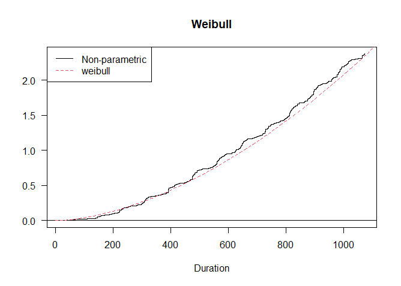

```{r setup, echo = FALSE, cache = FALSE, message = FALSE}
rm(list = ls())
library(tidyverse)
library(dplyr)
library(knitr)
library(kableExtra)
library(survival)
library(MASS)
## Global options
opts_chunk$set(echo      = TRUE,
	             cache     = TRUE,
               prompt    = FALSE,
               tidy      = FALSE,
               comment   = NA,
               message   = FALSE,
               warning   = FALSE,
               dpi       = 150,
               fig.width = 8, 
               fig.asp   = 5/7,
               fig.align = "center")
# attr.source = '.numberLines'
```

# Model selection with tests

```{r import data, echo = FALSE, cache = FALSE, message = FALSE,comment=NA}
aids<-read_csv("aids.csv")
n <- nrow(aids)
data<- aids |>
  janitor::clean_names()|>
  dplyr::select(time, cid, trt, everything())
fit1<-coxph(Surv(time, cid) ~ . , data = data)
stepwise <- stepAIC(fit1, direction = "backward",k = log(n),trace = F) # BIC

```

```{r}
summary(stepwise) 
broom::tidy(stepwise) |>kbl()
```


Our goal is to investigate the difference between two groups of different treatments(ZDV), therefore we pre-specified to stratify by treatment in the model.


# Graphical Methods

Recall a PH model, $S(t|Z=z) = e^{-\int h_0(t)e^{\beta z}dt} = S_0(t)^{e^{\beta z}}$, by using a log-log transformation, i.e., $log\{-logS(t|Z=z)\}$, we have
$$log\{-log\hat{S}(t|Z=z)\}-log\{-log\hat{S_0}(t)\} = \beta $$ for indicator variable $Z$. This indicates two parallel lines under proportionality assumption.

```{r}
library(ggfortify)
library(StepReg)
data_fit <- data |>
  dplyr::select(time, cid, treat, preanti, symptom, offtrt, cd420, cd820) |>
  mutate_at(c(3, 5, 6), .funs = ~as.factor(.))


# --- treat ---
# km plot
fit_km_treat <- survfit(Surv(time, cid) ~ treat, data_fit)
autoplot(fit_km_treat) + theme_bw() +
  labs(x = "Time (days)", y = "Survival Function",
       title = "Kaplan-Meier Survival Estimate")

# loglog vs. log time
# png("ph_checking_1.png", width = 500, height = 400)
plot(fit_km_treat, fun = "cloglog", col = c("black", "red"),
     xlab = "Time (days in log scale)", ylab = "log{-log(S(t))}",
     main = "Log of Negative Log of Estimated Survival Functions")
legend("topleft", legend = c("ZDV only", "Others"), col = c("black", "red"), 
       lty = 1, cex = 1)

# observed vs. fitted
fit_ph_treat <- coxph(Surv(time, cid) ~ treat, data_fit)

# png("ph_checking_2.png", width = 500, height = 400)
plot(fit_km_treat, col = c("blue", "darkgreen"),
     xlab = "Time (days)", ylab = "Survival Function",
     ylim = c(0.4,1),
     main = "Observed vs. Fitted")
lines(survfit(fit_ph_treat, newdata = data.frame(treat = as.factor(0))), # 0
      col = "red", conf.int = FALSE)
lines(survfit(fit_ph_treat, newdata = data.frame(treat = as.factor(1))), # 1
      col = "black", conf.int = FALSE)
legend("bottomleft", legend = c("Observed Male", "Observed Female",
                                "Fitted Male", "Fitted Female"), 
       col = c("blue", "darkgreen", "red", "black"), lty = 1, cex = 1, lwd = 2)
```

**Interpretation:** The above two figures demonstrate the proportional hazards assumption is hold given there is only one indicator variable `treat` in the model.

*  The above methods work only for categorical variable, the slope in plots of residuals such as Schoenfeld vs. time can be used instead for continuous cases.


## Model checking II

But first, let's use the same covariates as above, plus the corresponding interaction terms s.t., **covariate*time**. Results are shown as follows.

### Interaction test
```{r, fig.dim = c(10, 12)}
library(survminer)
# --- to be updated ---

# interaction
aids_interaction_fit <- coxph(Surv(time, cid == 1) ~ treat+ preanti+ symptom+ offtrt + cd420+ cd820+ log(time):treat+log(time):preanti+log(time):symptom+log(time):offtrt + log(time):cd420+log(time):cd820, data_fit)

summary(aids_interaction_fit)$coefficients |>
  kable("latex", 
        digits = 4, 
        escape = F, 
        booktabs = T, 
caption = "Regresion Coefficients Estimates of the Cox Model with Time Interactions") |>
  kable_styling(position = "center", 
                latex_options = "hold_position")
```

From the regression summary above, we can see that except `cd820:log(time)`, all the selected variable has a significant effect and interaction with time.

```{r}
aids_fit<-coxph(Surv(time, cid) ~ ., data_fit)
# residual
ggcoxzph(cox.zph(aids_fit), var = c("cd420"), df = 2, nsmo = 1000)
```

From the above plot and the Schoenfeld individual test p-value, we can see that the residual plot has a non-zero slope regression line, and the p-value of the tests is less than 0.05, which means the covariate cd420 doesn't meet the PH assumption.

```{r}
# ggsave("ph_checking_4.png", width = 6, height = 4)
ggcoxzph(cox.zph(aids_fit), var = c("cd820"), df = 2, nsmo = 1000)
```

However, the covariate cd820 is different. 

Zero slop in the plot indicates :
1. PH model is valid
2. No time-varying $\beta_ j$


# Parametric Analysis

### Fit exponential and Weilbull distributions

```{r, fig.align='center', fig.height=6}
library(flexsurv)
#parametric survival function
fit_exp_others = flexsurvreg(Surv(time, cid == 1) ~ 1, 
                        data = subset(data_fit, treat == 1), dist = "exp")
fit_exp_ZDV = flexsurvreg(Surv(time, cid == 1) ~ 1, 
                        data = subset(data_fit, treat == 0), dist = "exp")
fit_weib_others = flexsurvreg(Surv(time, cid == 1) ~ 1, 
                        data = subset(data_fit, treat == 1), dist = "weibull")
fit_weib_ZDV = flexsurvreg(Surv(time, cid == 1) ~ 1, 
                        data = subset(data_fit, treat == 0), dist = "weibull")


#plot km, exp fitted and weib fitted
plot(fit_exp_ZDV, conf.int = FALSE, ci = FALSE, col = "red", col.obs = "pink", 
     lty = "longdash", xlim = c(0,1300), 
     xlab = "Days", ylab = "Survival Probability",
     main = "KM and Parametric Est")
par(new = TRUE)
plot(fit_exp_others, conf.int = FALSE, ci = FALSE, col = "blue", col.obs = "skyblue", lty = "longdash", xlim = c(0,1000), xaxt = "n")
plot(fit_weib_ZDV, add = TRUE, ci = FALSE, col = "brown4")
plot(fit_weib_others, add = TRUE, ci = FALSE, col = "blue4")
legend("bottomleft", legend = c("Obs ZDV", "Obs others", "Exp ZDV", "Exp others", "Weib ZDV", "Weib others"), 
       col = c("pink", "skyblue", "red", "blue", "brown4", "blue4"),
       lty = c("solid", "solid", "longdash", "longdash", "solid", "solid"),
       lwd = c(2,2,2,2,2,2))

```

From the plot we can see that the observations in different treatment groups match different distributions.
More specifically, the survival function in the ZDV treatment group may be more likely to follow a exponential distribution. Inversely, the other one follows a Weibull distribution.

## Parametric Regression Models

### Parametric PH Models

```{r, eval=FALSE}
library(eha)
#backward selection, significance level = 0.05
fit_ph1 = eha::phreg(Surv(time, cid==1) ~ .,
                data = data_fit, dist = "weibull")
summary(fit_ph1)|>
  kable("latex", 
        digits = 4, 
        escape = F, 
        booktabs = T, 
caption = "Weibull (Parametric) PH Model Fitting") |>
  kable_styling(position = "center", 
                latex_options = "hold_position")
# it can be our final model


#compare the estimated baseline hazards with a non-parametric ph model
fit_cox =eha::coxreg(Surv(time, cid==1) ~ ., data = data_fit)
eha::check.dist(fit_ph1, fit_cox)
```



The fit of the Weibull baseline function is very close to the non-parametric one.

For a Weibull distribution, the AFT model is also a PH model.